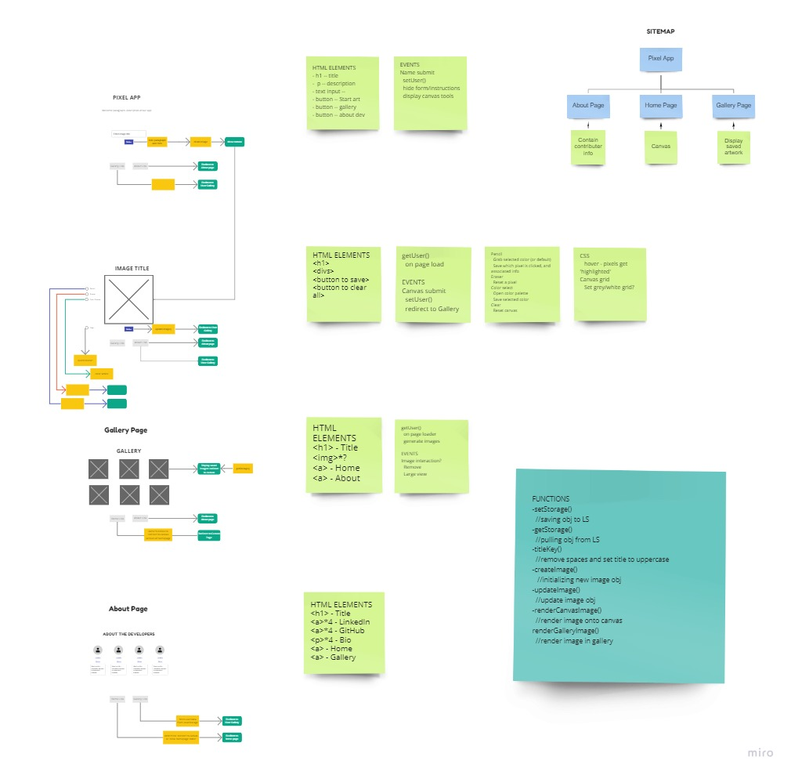

# Pixel Art 
## Project Description
PIXL is an application that allows the user to select grid section and modify its color to create a piece of pixel art. Users will be able to save and display their artwork on a gallery page via local storage. 

## Problem Domain & Solution
**PIXL** is an app designed as a fun tool for escaping the stress of existing in 2021. We wanted our app to be simple and user-friendly while still having the tools necessary to create something unique and exciting.

## Wireframes and Planning

[Click to View Miro Board](https://miro.com/app/board/o9J_lmmhXG8=/?invite_link_id=93017899949)

## Contributors
* [Emma Egstad](https://github.com/emmaegstad)
* [Fora Heims](https://github.com/fora-heims)
* [Violet Stewart](https://github.com/VioletKatrinStewart)
* [Ian Christiansen](https://github.com/ian-christiansen)

## Citation
* [HTML2Canvas](https://html2canvas.hertzen.com/)
* [Music](http://www.soundimage.org)
